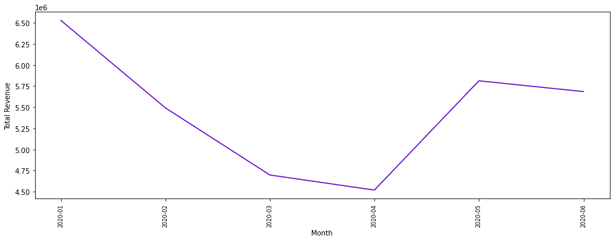
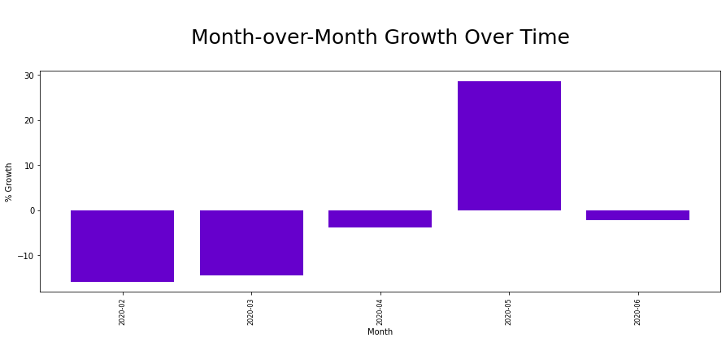

## OCEANAIR Business Transaction Review - Jan - June 2020


```python
import pandas as pd
pd.set_option('display.max_rows', 50)
pd.set_option('display.max_columns', 150)
import matplotlib.pyplot as plt
import numpy as np
```


```python
# Read in the dataset
df = pd.read_excel('data/CUSTOMER_BUSINESS_REVIEW_Jan-June.xlsx')
```

### Obtaining the overall trend for January through July 2020


```python
# Get the Month-Year from Report Date
df['Month_Year'] = df['REPORT DATE'].apply(lambda x: x.strftime('%Y-%m'))
```


```python
results = df.groupby('Month_Year').sum()
months = [month for month, df in df.groupby('Month_Year')]

plt.figure(figsize=(15, 5))
plt.plot(months, results['REVENUE'], color='#6600CC')
plt.xticks(months, rotation='vertical', size=8)
plt.ylabel('Total Revenue')
plt.xlabel('Month')

plt.show()
```





### Obtaining the Month-over-Month, Quarter-over-Quarter and Year-over-Year

#### Month over Month


```python
mom_df = pd.DataFrame(results['REVENUE'])
```


```python
mom_df['Last_Month'] = np.roll(mom_df['REVENUE'], 1)
mom_df = mom_df.drop(mom_df.index[0])
mom_df
```


<div>
<style scoped>
    .dataframe tbody tr th:only-of-type {
        vertical-align: middle;
    }

    .dataframe tbody tr th {
        vertical-align: top;
    }

    .dataframe thead th {
        text-align: right;
    }
</style>
<table border="1" class="dataframe">
  <thead>
    <tr style="text-align: right;">
      <th></th>
      <th>REVENUE</th>
      <th>Last_Month</th>
    </tr>
    <tr>
      <th>Month_Year</th>
      <th></th>
      <th></th>
    </tr>
  </thead>
  <tbody>
    <tr>
      <th>2020-02</th>
      <td>5492443.45</td>
      <td>6528101.93</td>
    </tr>
    <tr>
      <th>2020-03</th>
      <td>4697360.13</td>
      <td>5492443.45</td>
    </tr>
    <tr>
      <th>2020-04</th>
      <td>4519118.84</td>
      <td>4697360.13</td>
    </tr>
    <tr>
      <th>2020-05</th>
      <td>5812959.86</td>
      <td>4519118.84</td>
    </tr>
    <tr>
      <th>2020-06</th>
      <td>5685406.47</td>
      <td>5812959.86</td>
    </tr>
  </tbody>
</table>
</div>


#### Add the Growth to the Month over Month Dataframe


```python

# calculating the growth
mom_df['Growth'] = (mom_df['REVENUE'] / mom_df['Last_Month']) - 1
mom_df
```


<div>
<style scoped>
    .dataframe tbody tr th:only-of-type {
        vertical-align: middle;
    }

    .dataframe tbody tr th {
        vertical-align: top;
    }

    .dataframe thead th {
        text-align: right;
    }
</style>
<table border="1" class="dataframe">
  <thead>
    <tr style="text-align: right;">
      <th></th>
      <th>REVENUE</th>
      <th>Last_Month</th>
      <th>Growth</th>
    </tr>
    <tr>
      <th>Month_Year</th>
      <th></th>
      <th></th>
      <th></th>
    </tr>
  </thead>
  <tbody>
    <tr>
      <th>2020-02</th>
      <td>5492443.45</td>
      <td>6528101.93</td>
      <td>-0.158646</td>
    </tr>
    <tr>
      <th>2020-03</th>
      <td>4697360.13</td>
      <td>5492443.45</td>
      <td>-0.144759</td>
    </tr>
    <tr>
      <th>2020-04</th>
      <td>4519118.84</td>
      <td>4697360.13</td>
      <td>-0.037945</td>
    </tr>
    <tr>
      <th>2020-05</th>
      <td>5812959.86</td>
      <td>4519118.84</td>
      <td>0.286304</td>
    </tr>
    <tr>
      <th>2020-06</th>
      <td>5685406.47</td>
      <td>5812959.86</td>
      <td>-0.021943</td>
    </tr>
  </tbody>
</table>
</div>


#### Plotting the Month-over-Month Growth


```python
results = mom_df.drop(columns=['REVENUE', 'Last_Month'])
results['Months'] = results.index
results.reset_index(drop=True, inplace=True)
results
```


<div>
<style scoped>
    .dataframe tbody tr th:only-of-type {
        vertical-align: middle;
    }

    .dataframe tbody tr th {
        vertical-align: top;
    }

    .dataframe thead th {
        text-align: right;
    }
</style>
<table border="1" class="dataframe">
  <thead>
    <tr style="text-align: right;">
      <th></th>
      <th>Growth</th>
      <th>Months</th>
    </tr>
  </thead>
  <tbody>
    <tr>
      <th>0</th>
      <td>-0.158646</td>
      <td>2020-02</td>
    </tr>
    <tr>
      <th>1</th>
      <td>-0.144759</td>
      <td>2020-03</td>
    </tr>
    <tr>
      <th>2</th>
      <td>-0.037945</td>
      <td>2020-04</td>
    </tr>
    <tr>
      <th>3</th>
      <td>0.286304</td>
      <td>2020-05</td>
    </tr>
    <tr>
      <th>4</th>
      <td>-0.021943</td>
      <td>2020-06</td>
    </tr>
  </tbody>
</table>
</div>


```python
plt.figure(figsize=(15, 5))
plt.bar(results['Months'], results['Growth'] * 100, color='#6600CC')
plt.xticks(results['Months'], rotation='vertical', size=8)
plt.ylabel('% Growth')
plt.xlabel('Month')
plt.title("\n Month-over-Month Growth Over Time \n", size=25)
#plt.grid()
plt.show()
```




